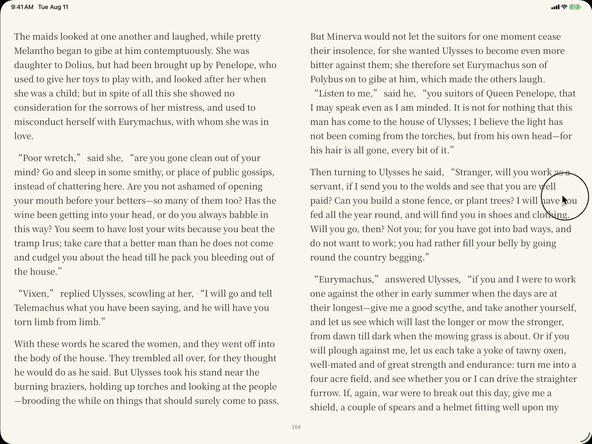
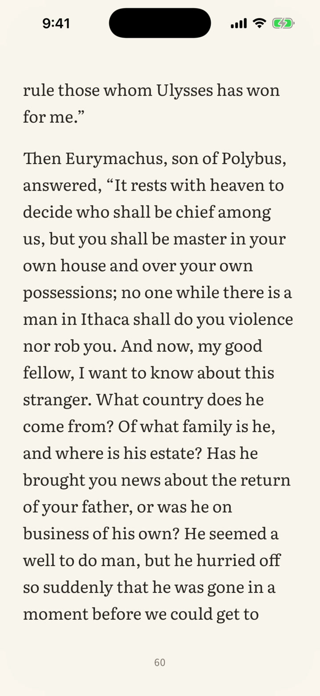
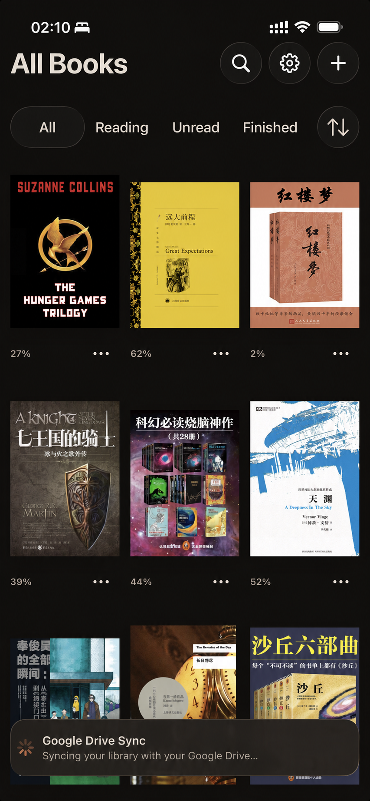

# Persimmon

<a href="./README.zh-CN.md">简体中文</a>

<em>Read. Nothing else.</em>

Persimmon is a minimal and fast EPUB reader for people who want to read without distractions.

  
   
  iPad · tap to play

  
   
  iPhone · tap to play

- **Simple and based.** A native-ish interface that leaves room for the book. No extra features like annotations or fancy AI stuff. Just focus on your reading.
- **Meticulously tuned page turns.** Responsive to your finger, fluid even through rapid, repeated swipes, and built to keep up with fast reading. It feels kinda like turning pages in a paperback. It also supports a rapid page-flip gesture, like thumbing backward through a paperback.
- **Free Google Drive sync.** You don't need to create a separate Persimmon account. Keep your books and reading progress with you across iOS and Android devices using your existing Google Drive.

## Interface

Real screens from Persimmon on iPhone, iPad, and Android.

  
  &nbsp;
  
  &nbsp;
  
   
  Library and sync · Reading controls · App settings

  
   
  iPad reading view and local font selection

